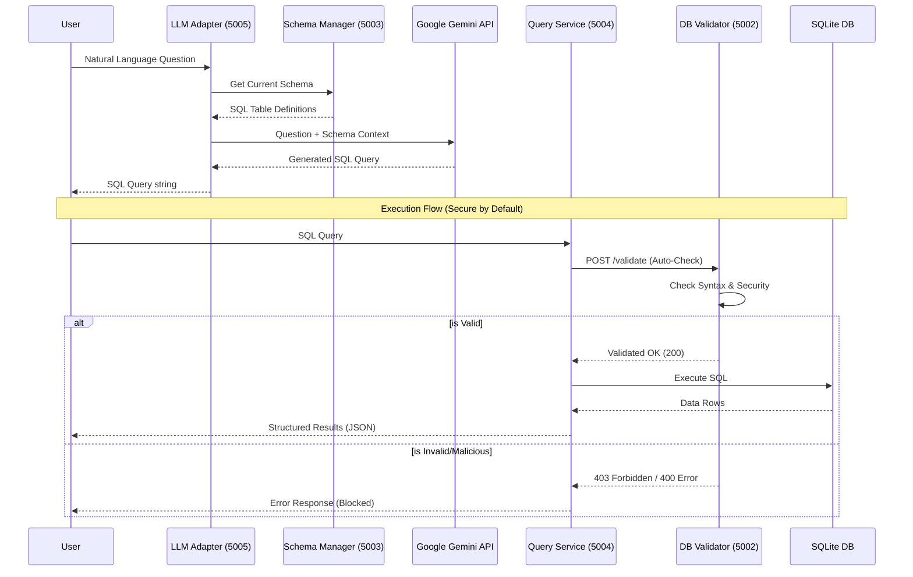

# DB with LLM

A microservices-based system that allows users to query SQLite databases using natural language, powered by Google Gemini.

## System Architecture

The project is structured as a set of independent FastAPI microservices, each handling a specific part of the data-to-information lifecycle.

### Core Services
*   **CSV Ingestor (Port 5001):** Loads structured CSV data into the SQLite database (`project_db.db`) and automatically infers the schema.
*   **DB Validator (Port 5002):** A security and syntax layer. It ensures SQL queries are syntactically correct and blocks destructive operations (e.g., `DROP`, `DELETE`, `UPDATE`).
*   **Schema Manager (Port 5003):** Extracts table names and `CREATE TABLE` statements from the database to provide context for the LLM.
*   **Query Service (Port 5004):** Executes validated SQL queries against the database and returns structured results (columns and data).
*   **LLM Adapter (Port 5005):** The "brain" of the system. It uses **Gemini 2.5 Flash** to translate natural language questions into precise SQL queries by retrieving the database schema from the Schema Manager.

---

## Query Flow Diagram



---

## Getting Started

### 1. Prerequisites
*   Python 3.10+
*   Google Gemini API Key

### 2. Setup
1.  Install dependencies:
    ```bash
    pip install -r requirements.txt
    ```
2.  Create a `.env` file in the root directory:
    ```bash
    GEMINI_API_KEY=your_api_key_here
    ```

### 3. Running the System
You can start and verify the entire system using the automated integration suite:
```bash
export PYTHONPATH=$PYTHONPATH:.
pytest tests/test_integration.py
```

### 4. Testing
Ensure your `PYTHONPATH` includes the project root:
```bash
export PYTHONPATH=$PYTHONPATH:.
```

To run **all tests** (Unit + Integration):
```bash
pytest
```

To run only **unit tests**:
```bash
pytest services/*/tests
```

To run only **integration tests** (starts all microservices automatically):
```bash
pytest tests/test_integration.py
```

## Security
The **DB Validator** service acts as a safety guardrail, rejecting any query containing restricted keywords like `DROP`, `DELETE`, `UPDATE`, or `TRUNCATE` to ensure the integrity of the data remains intact during natural language interactions.
